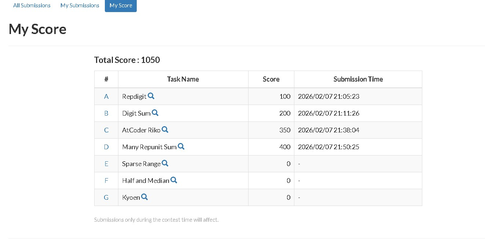

# AtCoder Contest 444 Solutions

## Submission Proof



## Question 1: Riko Pairing Problem

**Problem:** Find all valid divisors of total sum where array elements can be paired.

```python
from collections import Counter
n=int(input())
a=list(map(int,input().split()))
tots=sum(a)
max_a=max(a)
divis=set()
freq=Counter(a)
i=1
while i*i<=tots:
    if tots%i==0:
        divis.add(i)
        divis.add(tots//i)
    i+=1
poss=[]
for l in sorted(divis):
    if l<max_a:
        continue
    if l>max_a:
        comp=l-max_a
        if comp==max_a:
            if freq[max_a]%2!=0:
                continue
        else:
            if freq.get(comp,0)!=freq[max_a]:
                continue
    
    valid=True
    for x in freq:
        if x>l//2:
            continue
        if x==l:
            continue
        y=l-x
        if x==y:
            if freq[x]%2!=0:
                valid=False
                break
        else:
            if freq.get(y,0)!=freq[x]:
                valid=False
                break
    if valid:
        poss.append(l)

print(" ".join(map(str, poss)))
```

**Explanation:**

- Finds all divisors of the total sum using prime factorization approach.
- For each divisor, validates if array elements can form pairs that sum to that divisor.
- Uses frequency counting to ensure complementary pairs exist with matching counts, and outputs all valid divisors in ascending order.

---

## Question 2: Digit Sum Count

**Problem:** Count how many numbers from 1 to n have a digit sum equal to k.

```python
n,k=map(int,input().split())
def digit_sum(x):
    s=0
    while x>0:
        s+=x%10
        x//=10
    return s  
ans=0
for i in range(1,n+1):
    if digit_sum(i)==k:
        ans+=1
print(ans)
```

**Explanation:**

- Iterates through all numbers from 1 to n and calculates the digit sum for each.
- Digit sum is computed by repeatedly extracting the last digit using modulo and division operations.
- Counts how many numbers have digit sum exactly equal to k and returns the total count.

---

## Question 3: Many Repunit Sum

**Problem:** Calculate the sum result when adding repunits (numbers with all 1s) based on element frequencies.

```python
n=int(input())
a=list(map(int, input().split()))

max_a=max(a)
freq=[0]*(max_a+2)
for x in a:
    freq[x]+=1

cnt_ge=[0]*(max_a+2)
r=0
for pos in range(max_a,0,-1):
    r+=freq[pos]
    cnt_ge[pos]=r

dig=[]
cari=0
for pos in range(1,max_a+1):
    total=cari+cnt_ge[pos]
    dig.append(str(total%10))
    cari=total//10
while cari:
    dig.append(str(cari%10))
    cari//=10

print(''.join(reversed(dig)))
```

**Explanation:**

- Creates frequency array of input elements and computes count of numbers greater than or equal to each position.
- Performs digit-by-digit summation with carry propagation, simulating addition of large numbers represented as digits.
- Builds result from least significant to most significant digit, then reverses to get the final answer.

---

## Question 4: Repdigit Check

**Problem:** Determine if a number is a repdigit (all digits are the same).

```python
n=int(input())
# n=444

if len(set(list(str(n))))==1:
    print("Yes")
else:
    print("No")
```

**Explanation:**

- Converts the number to a string and extracts all unique digits using a set.
- If the set has exactly one element, all digits are identical (repdigit like 111, 444, 9999).
- Outputs "Yes" for repdigits and "No" otherwise.

---
